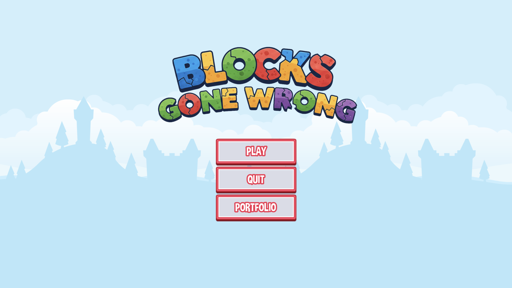
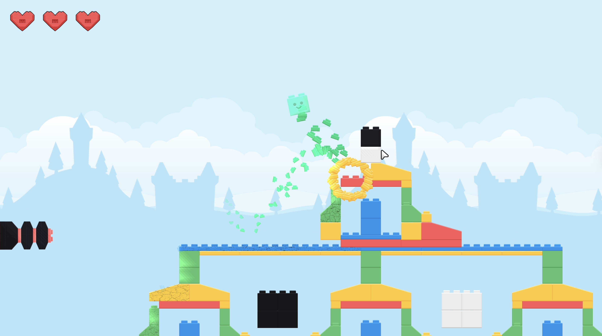

# Blocks Gone Wrong

**Blocks Gone Wrong** is a high-polish, physics-based arcade prototype developed using the **Godot 4** engine. This project serves as a technical demonstration of "Juicy" game design principles, featuring advanced 2D physics, procedural visual effects, and a robust architecture.

Developed by **MAY - Matt Against Yokai**.

---

## 🎮 Play in Browser
You can play the latest build of the game directly in your browser on itch.io:

---

## 📸 Screenshots

  
  

---

## 📺 Video Presentation
In this video, the prototype's core features and the technical logic behind the "Juicy" game feel are presented.

  <video src="videos/video.mp4" width="320" controls>
    Your browser does not support the video tag. You can watch the video <a href="videos/video.mp4">here</a>.
  </video>

---

## 🕹️ Project Overview
In *Blocks Gone Wrong*, the objective is to clear structured formations of colored blocks using physics-based projectiles. The project prioritises tactile feedback and game feel, ensuring every interaction—from firing the cannon to the final block explosion—is visually and high-fidelity.

## 🚀 Key Technical Features

### 🎥 Advanced Camera & Feedback System
* **Dynamic Tracking:** A camera system that smoothly interpolates between the player's cannon and active projectiles.
* **Procedural Screenshake:** A custom shake algorithm with intensity decay, providing visceral feedback for impacts and explosions.
* **Visual Juice:** Implementation of "Flash" effects on hit and frame-perfect particle synchronisation.

### 🎨 Visual Effects & Shaders
* **Procedural Damage Shader:** A custom GLSL fragment shader utilizing **Voronoi Noise** and **Domain Warping** to generate realistic cracks on blocks. The damage visuals scale dynamically based on the block's current health.
* **Particle Systems:** Optimised CPU-based emitters for debris and explosion effects, designed to match the colour palette of the destroyed assets.
* **Custom UI Cursor:** Implementation of custom cursors for a consistent aesthetic across platforms.

### 🔊 Professional Audio Architecture
* **Audio Bus Management:** Centralised mixing via specialised buses (Master, Music, SFX, UI) to ensure a balanced soundscape.
* **Input Debouncing:** A custom `AudioButton` class utilizing **static variables** to prevent audio clipping during rapid mouse-over events.
* **Polylphonic Playback:** Configured `AudioStreamPlayer` nodes to support multiple simultaneous sounds, preventing the "cutting off" of overlapping audio effects.

### 🧱 Architecture & Design Patterns
* **Signal-Driven Logic:** Decoupled communication between the Game Manager, projectiles, and blocks to ensure maintainability.
* **Automated Difficulty Scaling:** A data-driven approach where block health, textures, and particles are automatically assigned based on colour types (Yellow to Black).

---

## 🎮 Controls
* **Mouse Movement:** Aim Cannon.
* **Left Click:** Fire Projectile / Interact with UI.
* **Esc:** Return to Title Screen.

---

## 📜 Credits & Attributions

This project was built using high-quality assets from the following creators:

* **Development & Design:** [MAY - Matt Against Yokai](https://github.com/mlotr)
* **Art Assets:** 
    * [Kenney](https://kenney.nl/) (UI, Bricks, and Particles).
* **Audio & SFX:** 
    * [Kenney](https://kenney.nl/) (UI and Game SFX).
    * [Zapsplat](https://www.zapsplat.com/) (Impact and Environmental sounds).

---

## 📄 License
This project is licensed under the MIT License - see the [LICENSE](LICENSE) file for details. Assets used are subject to their respective licenses (CC0 1.0 Universal).

